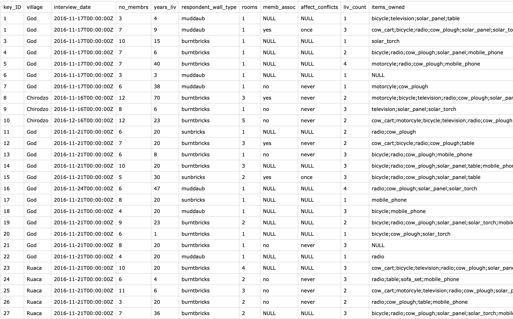

::: questions
-   What is needed to prepare a publication package for my research project?
-   What are best practices for organizing data and code in a publication package?
-   How do I document my package in such a way that is understandable for others?
:::

::: objectives
-   Produce a publication package for your own research project
:::

## Data management plan

{width="300" alt="Data management plan. Provide a copy of the most recent version of your data management plan"}

We will start with number 7 in our [list of publication package components](introduction.Rmd##the-contents-of-a-publication-package).

::: spoiler
#### Expand for details about the Data management plan

#### Steps to take

-   You should simply provide a copy of the most recent version of your data management plan.
-   Make sure it is saved in a [sustainable file format](https://dans.knaw.nl/en/file-formats/){target="_blank"}. This can be a .pdf or .odt file. If you have your most recent version in [dmponline](https://dmponline.eur.nl/){target="_blank"}, you can download it to your computer in pdf or an alternative format using the `Download` tab.
-   Provide the document with a good file name (use the [three principles for file naming described in this presentation](https://doi.org/10.5281/zenodo.7551576){target="_blank"}) and save it in the `documentation` folder.
-   It is also a good moment to take a look at the contents of your data management plan: is it still up to date? Do you need to take more steps to put it into practice?

#### Example file

See the `documentation/dmp_eur-pp_v1.pdf` file from the [EUR publication package example repository on Zenodo](https://doi.org/10.5281/zenodo.7956600){target="_blank"}

{width="300" alt="Data management plan from the EUR publication package example"}
:::

## Manuscript or publication

{width="300" alt="Must include a brief description of the problem definition, research design, data collection (sampling, selection and representativeness of informants) and methods used"}

Let's now continue chronologically with number 1 in our [list of publication package components](introduction.Rmd##the-contents-of-a-publication-package).

::: spoiler
#### Expand for details about the Manuscript or publication

#### Steps to take

-   According to the instructions in the [Guideline for the archiving of academic research for Faculties of Behavioural and Social Sciences in the Netherlands](https://doi.org/10.5281/zenodo.7583831){target="_blank"} (p.8) you should include the published (or accepted) manuscript or publication in your package.
-   Additionally, it is stated that you "must include a brief description of the problem definition, research design, data collection (sampling, selection and representativeness of informants) and methods used. An electronic version of the published manuscript will generally suffice."
-   Check that your manuscript contains this information.
-   Make sure the manuscript is saved in a [sustainable file format](https://dans.knaw.nl/en/file-formats/){target="_blank"}, most likely a .pdf.
-   In case your manuscript is not yet finished or accepted, wait with including the manuscript until the publication is accepted and/or finalized.

#### Example file

See the `manuscript_rsos_20230401.pdf` file from the [EUR publication package example repository on Zenodo](https://doi.org/10.5281/zenodo.7956600){target="_blank"} (note that this is a mock publication)

{width="300" alt="Manuscript from the EUR publication package example"}
:::

::: challenge
Short challenge to work together with your peer and look at the first two elements: the DMP and the manuscript.
:::

## Materials used

{width="300" alt="Include instructions, procedures, the design of the experiment and stimulus materials (interview guide, questionnaires, surveys, tests) necessary to replicate the research"}

The next step might involve some more work, beceause you need to include instructions, procedures, the design of the experiment and stimulus materials (interview guide, questionnaires, surveys, tests) necessary to replicate the research.

::: spoiler
#### Expand for details about the Materials used

#### Steps to take

-   According to the instructions in the [Guideline for the archiving of academic research for Faculties of Behavioural and Social Sciences in the Netherlands](https://doi.org/10.5281/zenodo.7583831){target="_blank"} (p.8) you should include:
    -   "The instructions, procedures, the design of the experiment and stimulus materials (interview guide, questionnaires, surveys, tests) that can reasonably be deemed necessary in order to replicate the research. The materials must be available in the language in which the research was conducted. The publication package must be in English."
-   Make sure all files are saved in a [sustainable file format](https://dans.knaw.nl/en/file-formats/){target="_blank"}, and that the files are [properly named](https://doi.org/10.5281/zenodo.7551576){target="_blank"}). Save the files in the `materials` folder.

#### Example files

See the codebook and the questionnaire in the `materials` folder from the [EUR publication package example repository on Zenodo](https://doi.org/10.5281/zenodo.7956600){target="_blank"}. Other examples can be found here: (include other examples, including qualitative)

{width="900" alt="Codebook from the EUR publication package example"}
:::

## Raw data files

{width="300" alt="Provide the most direct registration of behaviour or reactions of participants. Think of unfiltered export files of surveys, EEG measurements, recordings or transcripts. If needed, include all de-identification steps taken"}

::: spoiler
#### Expand for details about the Raw data files

#### Steps to take

-   According to the instructions in the [Guideline for the archiving of academic research for Faculties of Behavioural and Social Sciences in the Netherlands](https://doi.org/10.5281/zenodo.7583831){target="_blank"} (p.8) you should provide:
    -   The raw data files, "providing the most direct registration of the behaviour or reactions of test subjects/respondents, for example an unfiltered export file of an online survey or raw time series for an EEG measurement, e-dat files for an E-Prime behaviour experiment, recordings or transcripts of interviews, descriptions of observations, archive and other source or media material".
    -   In case you de-identified the data, you also need to include documentation of the steps taken to de-identify the data. Note that only personal data such as contact details or other variables not needed for the actual research should be removed for de-identification. All personal data that is part of the research data should be retained in the publication package for archiving (later you should of course remove identifiers before publication of the data in a public repository).
-   If the raw data files have been accessibly stored in an external data repository (such as a [DANS](https://dans.knaw.nl/en/){target="_blank"} Data Station), making reference to the files in this archive will suffice.
-   Make sure all files are saved in a [sustainable file format](https://dans.knaw.nl/en/file-formats/){target="_blank"} such as .csv, and that the files are [properly named](https://doi.org/10.5281/zenodo.7551576){target="_blank"}). Save the files in the `data` folder.

#### Example file

See the `safi_raw.csv` file in the `data` folder from the [EUR publication package example repository on Zenodo](https://doi.org/10.5281/zenodo.7956600){target="_blank"}

{width="900" alt="Raw data from the EUR publication package example"}
:::

## Preprocessing computer code

{width="300" alt="Include code (such as Atlas.Ti/SPSS/JASP syntax files, R scripts, etc.) describing the steps taken to process raw data into analysis data, including brief explanations of the steps in English"}

::: spoiler
#### Expand for details about the Preprocessing computer code
:::

## Processed data files

{width="300" alt="Provide data (either raw or processed) that were eventually analysed when preparing the article (e.g. a data file after transforming variables, after applying selection, etc.). If the raw data was analysed directly, step 3 suffices"}

::: spoiler
#### Expand for details about the Processed data files
:::

## Analysis computer code

{width="300" alt="Include code describing the steps taken to process the analysis data into the results reported in the manuscript, including brief explanations of the steps in English"}

::: spoiler
#### Expand for details about the Analysis computer code
:::

## Readme file

{width="300" alt="Provide a clear readme describing who was involved in the project, when the data was collected, which documents and files can be found where and how to interpret them"}

::: spoiler
#### Expand for details about the Readme file
:::

## Ethics documentation

{width="300" alt="Documents related to the ethical approval (e.g. approval letter, blank consent form)"}

::: spoiler
#### Expand for details about the Ethics documentation
:::

::: keypoints
-   tbd
:::
