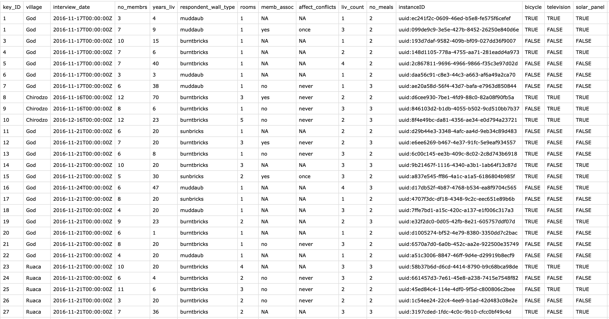

::: questions
-   How do I add the processed data to my publication package?
:::

::: objectives
-   Add the processed data files to your publication package
-   Apply best practices for file and variable names and file formats
:::

 snippet: Provide data (either raw or processed) that were eventually analysed when preparing the article (e.g. a data file after transforming variables, after applying selection, etc.). If the raw data was analysed directly, step 3 suffices](fig/05_processed-data.png){width="500" alt="Provide data (either raw or processed) that were eventually analysed when preparing the article (e.g. a data file after transforming variables, after applying selection, etc.). If the raw data was analysed directly, step 3 suffices"}

::: checklist
#### Steps to take

-   You need to provide the data files that were eventually analysed when preparing the article.
Examples are the data file after transforming variables and after applying selections. 
This means that in this step you should provide the outcome file from the two previous steps: the result of the preprocessing of the raw data.
-   If the raw data file was directly analysed, you do not need to provide any extra files in this step.
-   Make sure all files are saved in a [sustainable file format](https://dans.knaw.nl/en/file-formats/){target="_blank"} such as .csv, and that the files are [properly named](https://doi.org/10.5281/zenodo.7551576){target="_blank"}). Save the files in the `data` folder.
-   In the case that you are working with qualitative data such as transcripts, please note that given the richness of detail in qualitative interview data, it should not be considered anonymised but rather, pseudonymised. Because qualitative data often is contextual, you can’t promise to remove the indirect identifiers. When it comes to sharing this type of data, one option would be to ask your participants if you can share (parts of) the pseudonomised transcripts. Alternatively, you can consider sharing the data in a more redacted / summarised form. See below for some useful links. 
:::

::: callout
#### Example file

##### EUR prublication package example

See the `safi_processed-for-plotting.csv` file in the `data_output` folder from the [EUR publication package example repository on Zenodo](https://doi.org/10.5281/zenodo.7956600){target="_blank"}:

{width="80%" alt="Processed data from the EUR publication package example"}
##### Other examples

-   Summary of interviews

    -   [Hazejager (2025)](https://zenodo.org/records/17751189) shared a summary of the interviews as supplement to the  [RECHARGE - Recommendations for Sustainable Collaboration](https://zenodo.org/records/17063070) poster on Zeonodo.

### Useful links

-   [Making Qualitative Data Reusable](https://zenodo.org/records/8319060) by DANS 
-   [Sharing qualitative research data and materials](https://zenodo.org/records/7774044) by the EUR data stewards 
:::

