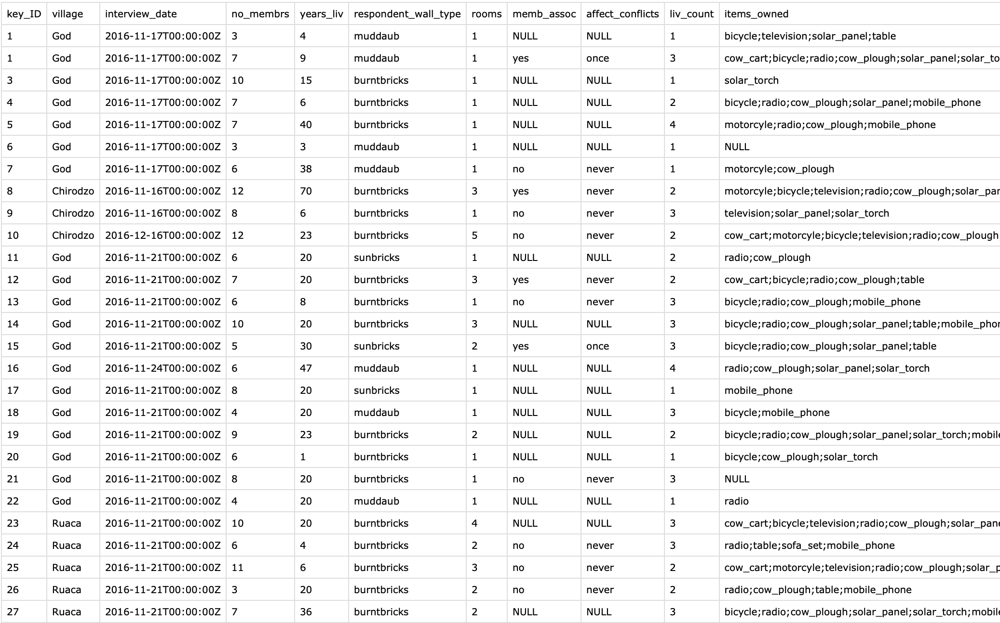

::: questions
-   How do I add the raw data to my publication package?
:::

::: objectives
-   Add the raw data files to your publication package
-   Apply best practices for file and variable names and file formats
:::

 snippet: Provide the most direct registration of behaviour or reactions of participants. 
Think of unfiltered export files of surveys, EEG measurements, recordings or transcripts. 
If needed, include all de-identification steps taken](fig/03_raw-data.png){width="500" alt="Provide the most direct registration of behaviour or reactions of participants. 
Think of unfiltered export files of surveys, EEG measurements, recordings or transcripts. 
If needed, include all de-identification steps taken"}

::: checklist
#### Steps to take

-   According to the instructions in the [Guideline for the archiving of academic research for Faculties of Behavioural and Social Sciences in the Netherlands](https://doi.org/10.5281/zenodo.7583831){target="_blank"} (p.8) you should provide:
    -   The raw data files, which are "the unedited data that are collected within the framework of a research project (...) providing the most direct registration of the behaviour or reactions of test subjects/respondents". Examples given:
        -   Registrations derived from experimental research (e.g., unfiltered export file of an online survey or raw time series for an EEG measurement, e-dat files for an E-Prime behaviour experiment)
        -   Survey data from questionnaires completed within the framework of research (including longitudinal research), collected by the researcher themselves or by an external fieldwork organization
        -   (Transcripts of) video material collected within the framework of qualitative research (open interviews, observations)
        -   Notes taken within the framework of qualitative research or research using source or media material
    -   In case you de-identified the data, you also need to include documentation of the steps taken to de-identify the data. Note that only personal data such as contact details or other variables not needed for the actual research should be removed for de-identification. All personal data that is part of the research data should be retained in the publication package for archiving (later you should of course remove identifiers before publication of the data in a public repository).
-   If the raw data files have been accessibly stored in an external data repository (such as a [DANS](https://dans.knaw.nl/en/){target="_blank"} Data Station), making reference to the files in this archive will suffice.
-   Make sure all files are saved in a [sustainable file format](https://dans.knaw.nl/en/file-formats/){target="_blank"} such as .csv, and that the files and variables are [properly named](https://doi.org/10.5281/zenodo.7551576){target="_blank"}) and clearly described. Save the files in the `data` folder.

:::

::: callout
#### Example file

See the `safi_raw.csv` file in the `data` folder from the [EUR publication package example repository on Zenodo](https://doi.org/10.5281/zenodo.7956600){target="_blank"}:

{width="80%" alt="Raw data from the EUR publication package example"}
:::

::: challenge
## Data exercise

Share a (de-identified) copy of your raw data file with a colleague or with your neighbor during the workshop.

-   Can they open the file without the need for any specialized software?

-   Is it clear to them what all the variables are? 

    -   If not, is there another file, such as a codebook or README in which the variable names are clearly explained?

-   Which improvements do they suggest to make the data file as clear as possible?

:::

